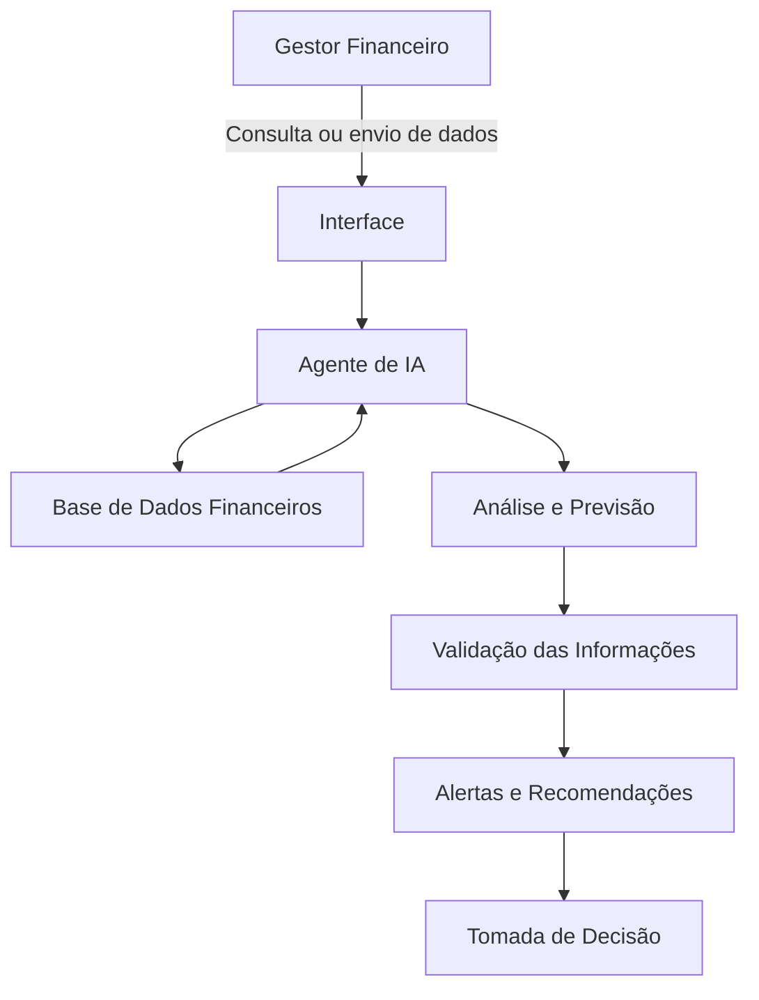

# Documentação do Agente de Fluxo de Caixa com IA Preditiva

## Caso de Uso

### Problema
> Qual problema financeiro seu agente resolve?

Falta de previsibilidade financeira.

### Solução
> Como o agente resolve esse problema de forma proativa?

O agente analisa continuamente:
-contas a pagar
-contas a receber
-vendas históricas
-sazonalidade de faturamento
-despesas fixas e variáveis
-comportamento de clientes
-atrasos recorrentes
-indicadores financeiros
Assim ele consegue prever falta de caixa futura, alertar riscos financeiros, sugerir ações preventivas, detectar padrões perigosos e apoiar decisões estratégicas.

### Público-Alvo
> Quem vai usar esse agente?

Empresas de pequeno e médio porte.

---

## Persona e Tom de Voz

### Nome do Agente
Adam

### Personalidade
> Como o agente se comporta? (ex: consultivo, direto, educativo)

Profissional, consultivo e proativo

### Tom de Comunicação
> Formal, informal, técnico, acessível?

O agente utiliza uma comunicação clara e objetiva, com linguagem profissional, mas fácil de entender, evitando excesso de termos técnicos. Seu objetivo é transmitir confiança e apoiar a tomada de decisão financeira sem gerar confusão ou alarmismo.

### Exemplos de Linguagem
- Saudação: "Olá! Sou seu assistente de análise financeira e estou aqui para ajudar no monitoramento do seu fluxo de caixa, identificação de riscos e apoio na tomada de decisões estratégicas."
- Confirmação: “Informações recebidas com sucesso. Já iniciei a análise do fluxo de caixa com base nos dados enviados.”
- Erro/Limitação: “No momento, não tenho informações suficientes para responder com precisão sobre essa situação. Para evitar uma análise incorreta, preciso de mais dados financeiros ou contexto adicional. Assim poderei oferecer uma recomendação mais segura e útil para a tomada de decisão.”

---

## Arquitetura

### Diagrama

### Componentes

| Componente | Descrição |
|------------|-----------|
| Interface | Streamlit |
| LLM | Ollama |
| Base de Conhecimento | CSV, Excel, banco de dados ou API com entradas e saídas financeiras |
| Validação | Verificação de consistência dos dados e prevenção de respostas incorretas |

---

## Segurança e Anti-Alucinação

### Estratégias Adotadas

- [ ] O agente responde apenas com base nos dados financeiros fornecidos
- [ ] As recomendações são baseadas em histórico e padrões identificados
- [ ] Quando não possui informação suficiente, o agente informa a limitação
- [ ] O agente não toma decisões sozinho, apenas apoia o usuário
- [ ] Dados inconsistentes ou incompletos geram alertas antes da análise
- [ ] Não realiza recomendações financeiras sem dados confiáveis

### Limitações Declaradas
> O que o agente NÃO faz?

Não substitui um contador, analista financeiro ou consultor especializado
Não toma decisões financeiras automaticamente
Não realiza investimentos ou movimentações bancárias
Não prevê eventos externos imprevisiveis, como crises econômicas repentinas
Não gera análises confiáveis sem dados atualizados e completos
Não oferece recomendações sem base em informações reais
Não garante lucro, apenas reduz riscos e melhora previsibilidade financeira
